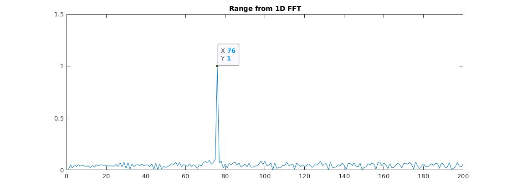
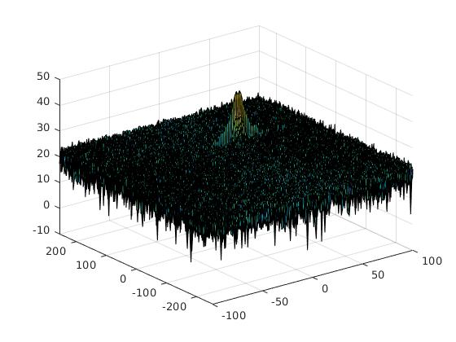
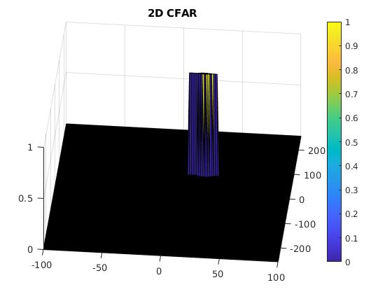

# Radar Target Generation and Detection

## FMCW Waveform Design
`slope` equals 2.0455e+13

```matlab
%% Radar Specifications 
%%%%%%%%%%%%%%%%%%%%%%%%%%%
speed_of_light = 3e8;
% Frequency of operation = 77GHz
freq_op = 77e9;      
% Max Range = 200m       
radar_max_range = 200;

% Max Velocity = 100 m/s
radar_max_velocity = 100;

% Range Resolution = 1 m
radar_range_resolution = 1;
%%%%%%%%%%%%%%%%%%%%%%%%%%%


%% User Defined Range and Velocity of target
%%%%%%%%%%%%%%%%%%%%%%%%%%%
% define the target's initial position and velocity. Note : Velocity
% remains contant
target_position = 75;
target_velocity = 25;
%%%%%%%%%%%%%%%%%%%%%%%%%%%
 


%% FMCW Waveform Generation
%%%%%%%%%%%%%%%%%%%%%%%%%%%
% *%TODO* :
%Design the FMCW waveform by giving the specs of each of its parameters.
% Calculate the Bandwidth (B), Chirp Time (Tchirp) and Slope (slope) of the FMCW
% chirp using the requirements above.


%Operating carrier frequency of Radar 
freq_op = 77e9;             %carrier freq
%Bandwidth(B sweep ) = speedoflight / ( 2 ∗ rangeResolution)
bandwidth_sweep = speed_of_light / (2 * radar_range_resolution);
%T chirp =5.5 * 2 * Rmax /c
t_chirp = 5.5 * 2 * radar_max_range / speed_of_light;
% slope of the chirp signal
slope = bandwidth_sweep / t_chirp;
%%%%%%%%%%%%%%%%%%%%%%%%%%%
```
## Simulation Loop
Simulate Target movement and calculate the beat or mixed signal for every timestamp.
A beat signal should be generated such that once range FFT implemented, it gives the correct range i.e the initial position of target assigned with an error margin of +/- 10 meters.

```matlab
%The number of chirps in one sequence. Its ideal to have 2^ value for the ease of running the FFT
%for Doppler Estimation. 
Nd=128;                   % #of doppler cells OR #of sent periods % number of chirps

%The number of samples on each chirp. 
Nr=1024;                  %for length of time OR # of range cells

% Timestamp for running the displacement scenario for every sample on each
% chirp
t=linspace(0,Nd * t_chirp,Nr * Nd); %total time for samples


%Creating the vectors for Tx, Rx and Mix based on the total samples input.
Tx=zeros(1,length(t)); %transmitted signal
Rx=zeros(1,length(t)); %received signal
Mix = zeros(1,length(t)); %beat signal

%Similar vectors for range_covered and time delay.
r_t=zeros(1,length(t));
td=zeros(1,length(t));


%% Signal generation and Moving Target simulation
% Running the radar scenario over the time. 

for i=1:length(t)         
    % *%TODO* :
    %For each time stamp update the Range of the Target for constant velocity. 
    r_t(i) = target_position + target_velocity * t(i);
    td(i) = (2.0 * r_t(i)) / speed_of_light;

    
    % *%TODO* :
    %For each time sample we need update the transmitted and
    %received signal. 
    Tx(i) = cos(2 * pi * (freq_op *  t(i)          + (slope *  t(i) ^ 2)        / 2.0));
    Rx(i) = cos(2 * pi * (freq_op * (t(i) - td(i)) + (slope * (t(i) - td(i))^2) / 2.0));
  
    
    % *%TODO* :
    %Now by mixing the Transmit and Receive generate the beat signal
    %This is done by element wise matrix multiplication of Transmit and
    %Receiver Signal
    Mix(i) = Tx(i) .* Rx(i);
end
```

## Range FFT (1st FFT)
Implement the Range FFT on the Beat or Mixed Signal and plot the result.
The initial target positon was at 75m and we cam see from below plot that the peak is around 76m, which is within the 1m range of the 
initial position.




## 2D CFAR

### Implementation steps for the 2D CFAR
- 1. Apply 2D FFT on the received radar signal so that we can get a 2D range-doppler-matrix (RDM). RDM contains all the information we need for 2D CFAR algorithm.

- 2. Apply 2D sliding window over the RDM
    - 2.1 Compute the noise level by averaging the training cells noise levels
    - 2.2 Compute the RDM threshold by adding a fixed offset to the noise level from `2.1` to improve the robustness and avoid false alarm
    - 2.3 If the RDM amplitude is greater than the threshold from `2.2`, then set the RDM value to be one, otherwises 0

### Parameters Used
```matlab
%Select the number of Training Cells in both the dimensions.
train_cells = 8;
train_band = 8;

%Select the number of Guard Cells in both dimensions around the Cell under 
%test (CUT) for accurate estimation
guard_cells = 4;
guard_band = 4;
```

Non-thresholded cells at the edges can be easily handle by checking its index against the `train_cells` and `guard_cells` values. 

### Final Output

