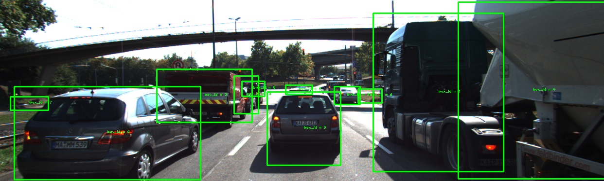
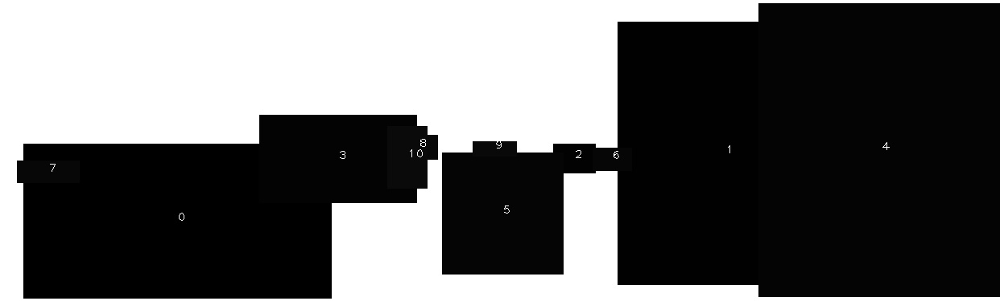
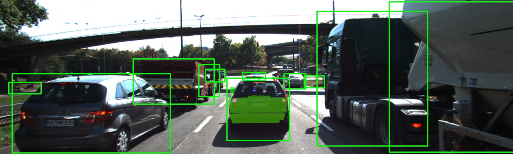
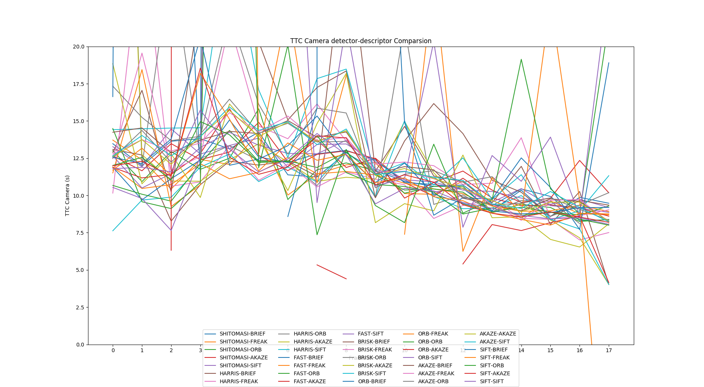
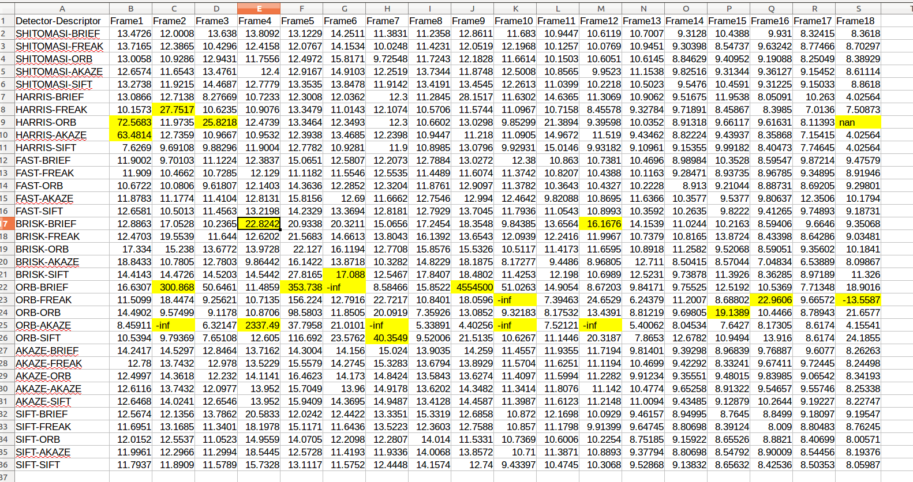

# SFND 3D Object Tracking Report

## FP.1 Match 3D Objects
 "matchBoundingBoxes" has been implmented very effiectly in this report.

To speed up the data association between keypoints and 2D bounding boxes detected by YOLOv3. An image mask has been created. For each detected bounding box, the image region defined by this box will be filled with color equals the bounding box id. 



 With this bounding box, we can find out the bounding box id for each keypoint quickly with below code. 
 The keyppoints belonging to this bounding box is also being stored.  
```cpp
for(auto &kp : keypoints) 
{
    int x = kp.pt.x, y = kp.pt.y;
    // This location has a valid box id, then keep this keypoint
    int box_id = (dataBuffer.end()-1)->maskImg.at<uint8_t>(y, x);
    if(box_id != 255 && (dataBuffer.end()-1)->boundingBoxes[box_id].lidarPoints.size() > 0) 
    {
        keypoints_roi.push_back(kp);
        (dataBuffer.end()-1)->boundingBoxes[box_id].keypoints.push_back(kp);
    }
}
```
Inside `void matchBoundingBoxes(std::vector<cv::DMatch> &matches, 
                        std::map<int, int> &bbBestMatches, 
                        DataFrame &prevFrame, 
                        DataFrame &currFrame)` function, with the keypoint matching information stored inside vector `matches`, we can build a mapping from all the keypoints inside current bounding fox to the bound box in previous frame. 
```cpp
    std::unordered_map<int, std::unordered_map<int, int>> freq;
    for(auto &match : matches) 
    {
        cv::KeyPoint kp0 = prevFrame.keypoints[match.queryIdx];
        cv::KeyPoint kp1 = currFrame.keypoints[match.trainIdx];

        int prev_box_id = prevFrame.maskImg.at<uint8_t>((int)kp0.pt.y, (int)kp0.pt.x);
        int curr_box_id = currFrame.maskImg.at<uint8_t>((int)kp1.pt.y, (int)kp1.pt.x);

        if(prev_box_id != 255 && curr_box_id != 255 && currFrame.boundingBoxes[curr_box_id].lidarPoints.size() > 0)
        {
            freq[prev_box_id][curr_box_id]++;
            // store DMatch
            currFrame.boundingBoxes[curr_box_id].kptMatches.push_back(match);
        }
    }
```
Also, with this method `clusterKptMatchesWithROI()` is not nessary anymore as we can figure out the all the matching information of keypoints inside bounding box inside current frame with the keypoints inside bounding box of previous frame automatically. Below is the relevant code. 
```cpp
// store DMatch
currFrame.boundingBoxes[curr_box_id].kptMatches.push_back(match);
```
One limitation with this method is we can only support upto 255 bounding box of each frame, so the valid box_id is within the range of [0, 254] as we need reserve 255 as a invalid bounding box id, which indicates no 2D objects detected in certain imageresion.  


## FP.2 Compute Lidar-based TTC
The code calculating the LIDAR TTC from the lecture produces very noisy TTC data. Therefore, a better and more robust method has been implement. As for the TTC measurement, we are only interested in the cars in front of all within the same lane. We can assume that the back of that car is a plane, which is a reasonable assumption. So we can try to find a 3D plane which can fit the lidar points within the bounding box of the leading vechile. The ransac method is also used to find thus plane. Once that plane is found, the medium values of the lidar points `X` axis is used as the distance measurement from the leading vechile to the ego vechile and we can then compute the TTC with below code 
```cpp
void computeTTCLidar(std::vector<LidarPoint> &lidarPointsPrev,
                     std::vector<LidarPoint> &lidarPointsCurr, double frameRate, double &TTC)
{
    // auxiliary variables
    double dT = 1.0 / frameRate; // time between two measurements in seconds

    double xPrev = ransacPlaneFitting(lidarPointsPrev, 15, 0.25); // 15: max iterations, 0.25 distance tolerance 
    double xCurr = ransacPlaneFitting(lidarPointsCurr, 15, 0.25);
    // compute TTC from both measurements
    TTC = xCurr * dT / (xPrev - xCurr);
}
```

## FP.3 Associate Keypoint Correspondences with Bounding Boxes
Keypoint correspondences to the bounding boxes which enclose them have been solved by the solution inside 
`FP.1 Match 3D Objects`. Here is the visualization to overlay the lidar points, keypoints and 2D bounding box. 


## FP.4 Compute Camera-based TTC
Compute the time-to-collision in second for all matched 3D objects using only keypoint correspondences from the matched bounding boxes between current and previous frame.
```cpp
void computeTTCCamera(std::vector<cv::KeyPoint> &kptsPrev, std::vector<cv::KeyPoint> &kptsCurr, 
                      std::vector<cv::DMatch> kptMatches, double frameRate, double &TTC, cv::Mat *visImg)
{
    vector<double> distRatios; // stores the distance ratios for all keypoints between curr. and prev. frame
    for (auto it1 = kptMatches.begin(); it1 != kptMatches.end() - 1; ++it1)
    { // outer keypoint loop

        // get current keypoint and its matched partner in the prev. frame
        cv::KeyPoint kpOuterCurr = kptsCurr.at(it1->trainIdx);
        cv::KeyPoint kpOuterPrev = kptsPrev.at(it1->queryIdx);

        for (auto it2 = kptMatches.begin() + 1; it2 != kptMatches.end(); ++it2)
        { // inner keypoint loop

            double minDist = 75.0; // min. required distance

            // get next keypoint and its matched partner in the prev. frame
            cv::KeyPoint kpInnerCurr = kptsCurr.at(it2->trainIdx);
            cv::KeyPoint kpInnerPrev = kptsPrev.at(it2->queryIdx);

            // compute distances and distance ratios
            double distCurr = cv::norm(kpOuterCurr.pt - kpInnerCurr.pt);
            double distPrev = cv::norm(kpOuterPrev.pt - kpInnerPrev.pt);

            if (distPrev > std::numeric_limits<double>::epsilon() && distCurr >= minDist)
            { // avoid division by zero

                double distRatio = distCurr / distPrev;
                distRatios.push_back(distRatio);
            }
        } // eof inner loop over all matched kpts
    }     // eof outer loop over all matched kpts

    // only continue if list of distance ratios is not empty
    if (distRatios.size() == 0)
    {
        TTC = NAN;
        return;
    }

    std::sort(distRatios.begin(), distRatios.end());
    long medIndex = floor(distRatios.size() / 2.0);
    double medDistRatio = distRatios.size() % 2 == 0 ? (distRatios[medIndex - 1] + distRatios[medIndex]) / 2.0 : distRatios[medIndex]; // compute median dist. ratio to remove outlier influence

    double dT = 1 / frameRate;
    TTC = -dT / (1 - medDistRatio);
}
```

## FP.5 Performance Evaluation 1
Find examples where the TTC estimate of the Lidar sensor does not seem plausible. Describe your observations and provide a sound argumentation why you think this happened.
The first 5 frames with LIDAR TTC estimation have been listed in below table as examples. 
- LIDAR-TTC-Lecture: the lidar ttc estimation method provide by the lecture
- LIDAR-TTC-Plane-Ransac: the lidar ttc estimation method proposed by this report


| Methods                  | Frame1        | Frame2  | Frame3  | Frame4  | Frame5  | 
| -------------            |:-------------:|   -----:|   -----:| -----:|-----:|
| LIDAR-TTC-Lecture        |3.81493	       | -7.26636	| -43.2941	| 7.11572	| 3.98777	| 12.8258	
| LIDAR-TTC-Plane-Ransac   |12.4342	       | 13.7275	| 13.8685	| 14.5388	| 15.4466	| 14.0817	

We can see that in Frame 2 and Frame 3 the `LIDAR-TTC-Lecture` method are obviously wrong as we should have negative TTC value. And in Frame 4 and 
and Frame 5 LIDAR-TTC-Lecture method has over 4 second difference where as the `LIDAR-TTC-Plane-Ransac` method implement by this report is very consistent across
frames. The reason why `LIDAR-TTC-Lecture` fails is due to the noisy LIDAR points and we might use the LIDAR points no in the leading vechile to compute the TTC. 
## FP.5 Performance Evaluation 2
Different detector and descriptor combination have been tested and the spreadsheet have been provided inside `report/camera.csv`, and the data is also demonstrated below, howere it is a bit hard to read the graph as there are total 35 comparsions.


The camera ttc with erroneous values have been highlighted with yellow color. 

It can be observed that the ttc estimation can be far off for HARRIS and ORB descriptors either with negative values
or very large values which does not make sense. 
The potential reasons why camera-based TTC estimation is way off:
- Outliers in the keypoint detection 
- Not enough keypoints in the TTC estimation, especially for harris detector. I have to adjust the threshold to make sure we have enough keypoints on the leading vechiles. 


